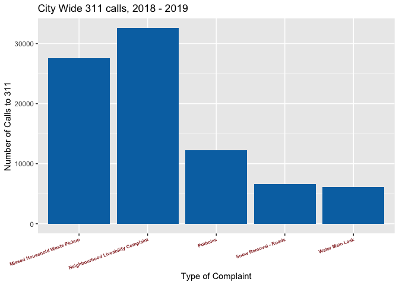

Background
----------

With the onset of the Coronavirus and consequent lock down, most of the
work that I was doing dried up. Since the plan was always to teach and
do odd jobs for the current year, this wasn’t the biggest deal, but it
still left me with a surplus of free time. Additionally, although it
wasn’t the end of the world to have to look for a job a little earlier
than I wanted, the job market is pretty brutal right now and it’s
difficult to compete and stand out among so many applicants. With that
in mind, I figured that it would probably be a better and more
productive use of my time to practice relevant skills and processes that
are useful as a data scientist / analyst rather than trying to push out
15 cover letters a day to jobs that won’t even look at my application.

The Data
--------

The City of Winnipeg has an open data library that contains geo-coded
(albeit scrambled) data on 311 calls for a number of years. For anyone
that doesn’t know, 311 is the code for Winnipeg City Services. Things
such as missed garbage pickups, graffiti complaints, neighbourhood
livability complaints, or other complaints that require municipal
government action. Here’s the complete list and number of all the
complaints.

<table class="table table-condensed">
<thead>
<tr>
<th style="text-align:right;">
Complaint Type
</th>
<th style="text-align:right;">
Number of Complaints
</th>
</tr>
</thead>
<tbody>
<tr>
<td style="text-align:right;">
Boulevard Mowing
</td>
<td style="text-align:right;">
552
</td>
</tr>
<tr>
<td style="text-align:right;">
Dog Complaint
</td>
<td style="text-align:right;">
2602
</td>
</tr>
<tr>
<td style="text-align:right;">
Frozen Catch Basin
</td>
<td style="text-align:right;">
3316
</td>
</tr>
<tr>
<td style="text-align:right;">
Graffiti
</td>
<td style="text-align:right;">
5270
</td>
</tr>
<tr>
<td style="text-align:right;">
Litter Container Complaint
</td>
<td style="text-align:right;">
939
</td>
</tr>
<tr>
<td style="text-align:right;">
Missed Garbage Collection
</td>
<td style="text-align:right;">
16044
</td>
</tr>
<tr>
<td style="text-align:right;">
Missed Recycling Collection
</td>
<td style="text-align:right;">
11497
</td>
</tr>
<tr>
<td style="text-align:right;">
Mosquito Complaint
</td>
<td style="text-align:right;">
25
</td>
</tr>
<tr>
<td style="text-align:right;">
Neighbourhood Liveability Complaint
</td>
<td style="text-align:right;">
32586
</td>
</tr>
<tr>
<td style="text-align:right;">
Potholes
</td>
<td style="text-align:right;">
12257
</td>
</tr>
<tr>
<td style="text-align:right;">
Sanding
</td>
<td style="text-align:right;">
2374
</td>
</tr>
<tr>
<td style="text-align:right;">
Sewer Backup
</td>
<td style="text-align:right;">
2892
</td>
</tr>
<tr>
<td style="text-align:right;">
Sidewalk Repairs
</td>
<td style="text-align:right;">
2784
</td>
</tr>
<tr>
<td style="text-align:right;">
Snow Removal - Roads
</td>
<td style="text-align:right;">
6656
</td>
</tr>
<tr>
<td style="text-align:right;">
Snow Removal - Sidewalks
</td>
<td style="text-align:right;">
1452
</td>
</tr>
<tr>
<td style="text-align:right;">
Tree Pest Caterpillar Complaint
</td>
<td style="text-align:right;">
765
</td>
</tr>
<tr>
<td style="text-align:right;">
Water Main Leak
</td>
<td style="text-align:right;">
6070
</td>
</tr>
</tbody>
</table>
Dividing 311 calls by Neighbourhood
===================================

One question that I find worth asking from this data set is as follows:
“Does the neighbourhood you live in determine how you demand City
Services?”. There are a few ways of thinking about this. On one hand,
you could say that as people become wealthier they will have higher
expectations for what their municipal tax dollars can do for them. In
economics-speak, we would say “complaints are a normal good”, or, that
complaints rise with income. It could also be the case that as people
become wealthier and have more leisure time, they tend to be more
willing to spend some of that leisure time calling 311. This story is
consistent with the idea of an elderly neighbour being nitpicky or
overusing the 311 service line - in other words, a “narc”.

On the other hand, a higher number of 311 calls could be representative
of a neighbourhood that is under-served or ignored by City departments.
For example, in a neighbourhood that is properly served by City
departments, a caller only has to notify the City of an issue once
before the City responds and addresses the complaint. Meanwhile, in a
neighbourhood that is under-served by the City, multiple callers may
notify the City about the same complaint multiple times until the
complaint is addressed. If we were to suppose that neighbourhoods with
lower levels of income also have a larger number of calls to 311, this
could be indicative that these neighbourhoods are under-served by City
services. This is concerning as it would indicate that the political
influence of individual citizens in Winnipeg is split along economic
lines, and that being a resident of a wealthier neighbourhood guarantees
you better access to City services.

Exploratory Analysis
====================

In order to answer this question I think it’s important to first do some
exploratory analysis of the data. Before we really get started, I’ve
noticed that “Missed Garbage Collection” and “Missed Recycling
Collection” could easily be represented as “Missed Household Waste
Collection”. Although, if it’s the case that every missed garbage
collection corresponds to a missed recycling collection, merging these
two into one category would effectively be double counting and over
represent the number of missed household waste pickups. So, let’s see if
they’re statistically different:

<table class="table table-condensed">
<thead>
<tr>
<th style="text-align:right;">
Difference
</th>
<th style="text-align:right;">
Garbage\_Mean
</th>
<th style="text-align:right;">
Recycling\_Mean
</th>
<th style="text-align:right;">
T\_Stat
</th>
<th style="text-align:right;">
p.value
</th>
</tr>
</thead>
<tbody>
<tr>
<td style="text-align:right;">
20.46107
</td>
<td style="text-align:right;">
73.93548
</td>
<td style="text-align:right;">
53.47442
</td>
<td style="text-align:right;">
2.988137
</td>
<td style="text-align:right;">
0.002976751
</td>
</tr>
</tbody>
</table>
It appears that when grouped by neighbourhood, the number of missed
garbage pickups over the two year period is greater than the number of
missed recycling pick ups. This means that a missed garbage pick up does
not guarantee a missed recycling pick up. Let’s take a look at how each
different category of 311 call is related to one another.

Looking at the correlation matrix we can see that recycling and garbage
missed pick ups are strongly correlated with one another, while litter
container complaints and tree caterpillar complaints are also strongly
correlated with one another. Both of these make intuitive sense, as it
is probably often the case that a missed garbage pick up is due to
either user error (not putting the bins out) or other factors (weather
or construction that make doing a route in the proper time impossible),
and litter containers that the city is responsible for are often in
parks and other wooded areas, where there are an abundance of canker
worms.

I’m going to make a merged category for both recycling and garbage
collection and title it “Missed Household Waste Collection”. I think
that the distinction between recycling and garbage pick ups is somewhat
arbitrary for the purpose of understanding the difference among
neighbourhood service levels, so I feel like it’s fine to lump the two
together, however I would understand if someone were to feel like this
creates bias in the analysis.

The data set contains 235 different neighbourhoods, so I’m only going to
graph the top 5 neighbourhoods and categories for ease of reading in the
next few graphs.

Most calls to 311, by neighbourhood
===================================

 We
can see that the number of calls from William Whyte is almost double
that of the next closest neighbourhood, St. Johns.
 We
can also see that neighbourhood livability complaints and missed
household waste pickups dominate the number of calls to 311.
 In
William Whyte, the number of neighbourhood livability complaints is
astronomical when compared to the other categories. Here are the top 5
categories of complaints, as well as graffiti. It’s important to note
that the scale of the y-axis for each category changes for ease of
readability in each graph.

Additional Graphs
=================

One category that I feel is near and dear to the average Winnipegger’s
heart is the poor condition of the roads in Winnipeg. Another few
issues, if I were to think of someone like my Dad as the average
Winnipegger, would be that the presence of graffiti is distasteful or
that the trash not being picked up is a public policy failure. (No
offense to my dad, I’m sure he wouldn’t really say that if you were to
ask him, it’s just easy to use him or someone of his age/demographic as
a straw-man). With that being said, here are three additional graphs
that are specially formatted for each respective issue:

Conclusion
==========

That’s all I’m going to do for exploratory analysis. Next, I’m going to
combine 2011 National Household Survey data on income, age, and family
size with the existing data set to show the relationship between service
level and household income. There are a number of data sets publicly
available through the City of Winnipeg’s [open data
portal](https://data.winnipeg.ca/) that I’m going to be using throughout
this series. Hopefully you enjoyed this article and stay tuned for the
next part in this series.
